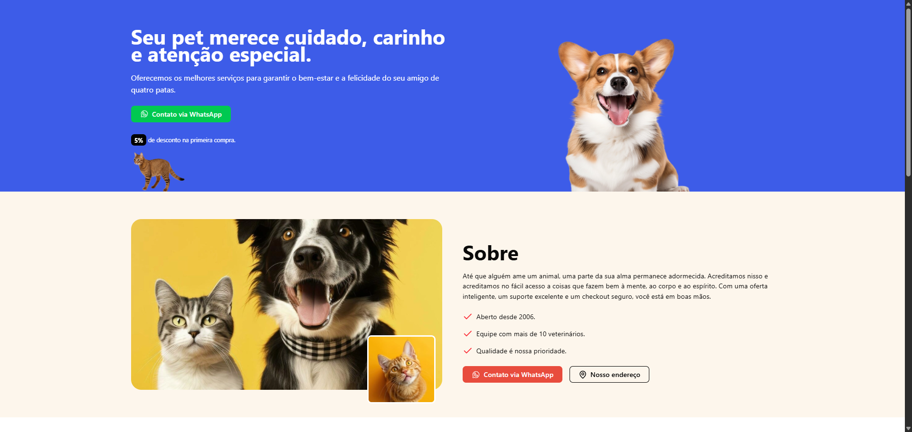

# PetCare Landing Page

<h3>Site desenvolvido com Next.js e TypeScript, utilizando Tailwind CSS para estilização, shadcn/ui para componentes,
  Lucide e Phosphor Icons para ícones modernos, Embla Carousel para carrosséis interativos, clsx para manipulação
  de classes, AOS para animações suaves e Biome.js para linting e formatação de código.</h3>

<a href="https://petcareoficial.netlify.app/">Clique aqui para ver</a>

# Imagens:

  

  

